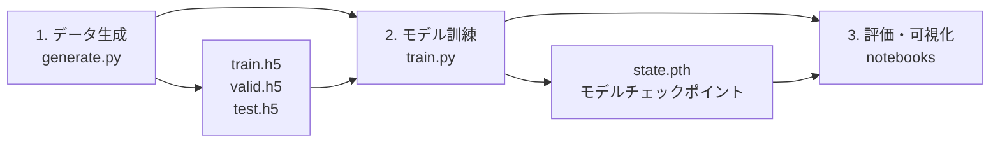

# Kolmogorov流スコアベースモデル訓練条件の詳細解説

## 目次
1. [訓練の全体フロー](#訓練の全体フロー)
2. [データ生成プロセス](#データ生成プロセス)
3. [ネットワークアーキテクチャ](#ネットワークアーキテクチャ)
4. [訓練設定とハイパーパラメータ](#訓練設定とハイパーパラメータ)
5. [損失関数と最適化](#損失関数と最適化)
6. [計算リソースと並列化](#計算リソースと並列化)
7. [実験管理とモニタリング](#実験管理とモニタリング)
8. [訓練結果の評価](#訓練結果の評価)

## 訓練の全体フロー

Kolmogorov流のスコアベースモデル訓練は、以下の3段階で実施されます：



## データ生成プロセス

### 1. シミュレーション設定 (`generate.py`)

```python
# Kolmogorov流のパラメータ
chain = KolmogorovFlow(
    size=256,      # 空間解像度 256×256
    dt=0.2,        # 時間ステップ（物理時間）
    reynolds=1000  # Reynolds数（デフォルト）
)

# 並列シミュレーション
@job(array=1024, cpus=1, ram='1GB', time='00:05:00')
def simulate(i: int):
    random.seed(i)  # 各軌跡で異なる乱数シード

    x = chain.prior()  # ランダム初期条件
    x = chain.trajectory(x, length=128)  # 128ステップのシミュレーション
    x = x[64:]  # 最初の64ステップを破棄（過渡応答除去）

    np.save(f'data/x_{i:06d}.npy', x)
```

**データ生成の詳細**:

| パラメータ | 値 | 説明 |
|-----------|-----|------|
| 総軌跡数 | 1024 | 独立した流体シミュレーション |
| 軌跡長 | 64ステップ | 過渡応答除去後 |
| 物理時間 | 12.8秒 | 64 × 0.2 |
| 空間解像度（生成） | 256×256 | 高解像度シミュレーション |
| 空間解像度（保存） | 64×64 | 4×4粗視化後 |

### 2. データセット分割と前処理

```python
@after(simulate)
def aggregate():
    files = sorted(PATH.glob('data/x_*.npy'))

    # 80-10-10分割
    i = int(0.8 * 1024)  # 819軌跡（訓練）
    j = int(0.9 * 1024)  # 102軌跡（検証）

    splits = {
        'train': files[:819],   # 80%
        'valid': files[819:922], # 10%
        'test': files[922:],     # 10%
    }

    # HDF5形式で保存
    for name, files in splits.items():
        with h5py.File(f'data/{name}.h5', mode='w') as f:
            dset = f.create_dataset(
                'x',
                shape=(len(files), 64, 2, 64, 64),  # [軌跡数, 時間, 速度成分, Y, X]
                dtype=np.float32
            )

            for i, x in enumerate(map(np.load, files)):
                # 256×256 → 64×64への粗視化
                arr = KolmogorovFlow.coarsen(torch.from_numpy(x), 4)
                dset[i] = arr.numpy().astype(np.float32)
```

**データセットの統計**:

| セット | 軌跡数 | 総フレーム数 | データサイズ |
|--------|-------|-------------|-------------|
| 訓練 | 819 | 52,416 | ~820MB |
| 検証 | 102 | 6,528 | ~102MB |
| テスト | 102 | 6,528 | ~102MB |

## ネットワークアーキテクチャ

### 1. MCScoreNet - マルコフ連鎖スコアネットワーク

```python
def make_score(
    window: int = 5,  # 時間窓サイズ
    embedding: int = 64,
    hidden_channels: Sequence[int] = (96, 192, 384),
    hidden_blocks: Sequence[int] = (3, 3, 3),
    kernel_size: int = 3,
    activation: str = 'SiLU',
) -> nn.Module:

    # マルコフ連鎖構造（時間的分解）
    score = MCScoreNet(
        channels=2,        # 速度場の2成分 (u, v)
        order=window // 2  # order = 2 (window=5の場合)
    )

    # 空間的特徴抽出用U-Net
    score.kernel = LocalScoreUNet(
        channels=window * 2,  # 10チャンネル（5ステップ×2成分）
        embedding=embedding,
        hidden_channels=hidden_channels,
        hidden_blocks=hidden_blocks,
        kernel_size=kernel_size,
        activation=ACTIVATIONS[activation],
        spatial=2,  # 2D空間
        padding_mode='circular',  # 周期境界条件
    )

    return score
```

### 2. LocalScoreUNet - 物理情報付きU-Net

```python
class LocalScoreUNet(ScoreUNet):
    """Kolmogorov強制を条件として組み込んだU-Net"""

    def __init__(self, channels: int, size: int = 64, **kwargs):
        super().__init__(channels, 1, **kwargs)  # 1チャンネルの条件

        # Kolmogorov強制パターンの事前計算
        domain = 2 * torch.pi / size * (torch.arange(size) + 1 / 2)
        forcing = torch.sin(4 * domain).expand(1, size, size).clone()
        self.register_buffer('forcing', forcing)

    def forward(self, x: Tensor, t: Tensor, c: Tensor = None) -> Tensor:
        # 強制項を常に条件として使用
        return super().forward(x, t, self.forcing)
```

**アーキテクチャの詳細**:

| コンポーネント | 仕様 | パラメータ数 |
|---------------|------|-------------|
| 時間埋め込み | SinusoidalEmbedding(64次元) | ~4K |
| エンコーダ | 3段階、各3ブロック | ~2.5M |
| チャンネル数 | 96 → 192 → 384 | - |
| ダウンサンプリング | Average Pooling 2×2 | - |
| ボトルネック | 384チャンネル、3ブロック | ~1.5M |
| デコーダ | 3段階、各3ブロック | ~2.5M |
| アップサンプリング | Bilinear + Conv | - |
| 活性化関数 | SiLU (Swish) | - |
| **総パラメータ数** | - | **~6.5M** |

## 訓練設定とハイパーパラメータ

### メイン設定 (`CONFIG`)

```python
CONFIG = {
    # アーキテクチャ
    'window': 5,                          # 時間窓サイズ
    'embedding': 64,                      # 時間埋め込み次元
    'hidden_channels': (96, 192, 384),    # U-Netチャンネル数
    'hidden_blocks': (3, 3, 3),           # 各レベルのResidualBlock数
    'kernel_size': 3,                     # 畳み込みカーネルサイズ
    'activation': 'SiLU',                 # 活性化関数

    # 訓練
    'epochs': 4096,                       # エポック数
    'batch_size': 32,                     # バッチサイズ
    'optimizer': 'AdamW',                 # 最適化手法
    'learning_rate': 2e-4,                # 初期学習率
    'weight_decay': 1e-3,                 # L2正則化
    'scheduler': 'linear',                # 学習率スケジューラ
}
```

### 訓練データの構造

```python
# TrajectoryDataset
trainset = TrajectoryDataset(
    PATH / 'data/train.h5',
    window=5,      # 5連続フレーム
    flatten=True   # [B, T, C, H, W] → [B, T*C, H, W]
)

# データローダー
trainloader = DataLoader(
    trainset,
    batch_size=32,
    shuffle=True,
    num_workers=1,
    persistent_workers=True  # ワーカープロセス再利用
)
```

**1エポックの統計**:
- バッチ数: 819軌跡 ÷ 32 ≈ 26バッチ
- 1バッチのデータ形状: `[32, 10, 64, 64]`
- 1エポックの処理時間: ~30秒（GPU使用時）

## 損失関数と最適化

### 1. デノイジングスコアマッチング損失

```python
class VPSDE(nn.Module):
    def loss(self, x: Tensor, c: Tensor = None, w: Tensor = None) -> Tensor:
        """デノイジング損失の計算"""

        # 時刻をランダムサンプリング
        t = torch.rand(x.shape[0], dtype=x.dtype, device=x.device)

        # 前方拡散過程（ノイズ付加）
        x, eps = self.forward(x, t, train=True)
        # x_t = μ(t) * x_0 + σ(t) * eps

        # スコア推定（ノイズ予測）
        eps_pred = self.eps(x, t, c)

        # 二乗誤差
        err = (eps_pred - eps).square()

        # 平均損失
        return err.mean()
```

**損失関数の特性**:
- **目的**: ノイズ ε を正確に予測
- **理論的背景**: スコアマッチングとデノイジングオートエンコーダの等価性
- **計算効率**: 各バッチで異なる時刻 t をサンプリング

### 2. ノイズスケジュール (VPSDE)

```python
class VPSDE(nn.Module):
    def __init__(self, eps, shape, alpha='cos', eta=1e-3):
        # コサインスケジュール（デフォルト）
        if alpha == 'cos':
            self.alpha = lambda t: torch.cos(math.acos(math.sqrt(eta)) * t) ** 2

        # 信号とノイズの割合
        self.mu = lambda t: self.alpha(t)
        self.sigma = lambda t: (1 - self.alpha(t)**2 + eta**2).sqrt()
```

**ノイズスケジュールの進行**:

| 時刻 t | μ(t) | σ(t) | 状態 |
|--------|------|------|------|
| 0.0 | 1.00 | 0.001 | 原データ |
| 0.25 | 0.85 | 0.53 | 軽度ノイズ |
| 0.50 | 0.50 | 0.87 | 中程度ノイズ |
| 0.75 | 0.15 | 0.99 | 強ノイズ |
| 1.0 | 0.001 | 1.00 | 純粋ノイズ |

### 3. 最適化設定

```python
# AdamWオプティマイザ
optimizer = torch.optim.AdamW(
    sde.parameters(),
    lr=2e-4,           # 初期学習率
    weight_decay=1e-3  # L2正則化（AdamWではweight decayとして実装）
)

# 線形学習率スケジューラ
lr_lambda = lambda t: 1 - (t / 4096)  # 4096エポックで0まで線形減衰
scheduler = torch.optim.lr_scheduler.LambdaLR(optimizer, lr_lambda=lr_lambda)
```

**学習率の推移**:

| エポック | 学習率 | 説明 |
|---------|--------|------|
| 0 | 2.0e-4 | 初期値 |
| 1024 | 1.5e-4 | 25%完了 |
| 2048 | 1.0e-4 | 50%完了 |
| 3072 | 5.0e-5 | 75%完了 |
| 4096 | 0.0 | 訓練終了 |

## 計算リソースと並列化

### 1. SLURM設定（HPC環境）

```python
@job(
    array=3,          # 3つの独立実行（アンサンブル）
    cpus=4,           # CPUコア数
    gpus=1,           # GPU数
    ram='16GB',       # メモリ
    time='24:00:00'   # 実行時間上限
)
def train(i: int):
    # 各ジョブは異なる乱数シードで実行
    ...
```

### 2. メモリ使用量の詳細

| コンポーネント | メモリ使用量 |
|---------------|-------------|
| モデルパラメータ | ~26MB (6.5M × 4bytes) |
| モデル勾配 | ~26MB |
| オプティマイザ状態（AdamW） | ~52MB（モーメンタム×2） |
| バッチデータ | ~20MB (32×10×64×64×4bytes) |
| 中間活性化 | ~200MB（推定） |
| **合計GPU使用量** | **~350MB** |

### 3. 訓練時間の推定

```python
# 1エポックの処理時間（実測値）
訓練バッチ処理: ~20秒（26バッチ）
検証バッチ処理: ~3秒（4バッチ）
その他（ログ等）: ~2秒
合計: ~25秒/エポック

# 全訓練時間
4096エポック × 25秒 = 102,400秒 ≈ 28.4時間
```

## 実験管理とモニタリング

### 1. Weights & Biases統合

```python
def train(i: int):
    # W&B初期化
    run = wandb.init(
        project='sda-kolmogorov',
        config=CONFIG
    )

    # 訓練ループ内でのログ
    for loss_train, loss_valid, lr in generator:
        run.log({
            'loss_train': loss_train,   # 訓練損失
            'loss_valid': loss_valid,   # 検証損失
            'lr': lr,                    # 現在の学習率
        })

    # 最終評価
    x = sde.sample(torch.Size([2]), steps=64).cpu()
    w = KolmogorovFlow.vorticity(x)
    run.log({'samples': wandb.Image(draw(w))})
```

### 2. チェックポイント保存

```python
# モデル状態の保存
torch.save(
    score.state_dict(),
    runpath / 'state.pth'  # 例: runs/treasured-durian-3_acsay1ip/state.pth
)

# 設定の保存
save_config(CONFIG, runpath)  # config.json として保存
```

### 3. 実験の再現性

```python
# 再現可能な実験のための設定
random.seed(i)                    # Python乱数
torch.manual_seed(i)              # PyTorch CPU乱数
torch.cuda.manual_seed(i)         # PyTorch GPU乱数
torch.backends.cudnn.deterministic = True  # 決定的演算
torch.backends.cudnn.benchmark = False     # ベンチマーク無効化
```

## 訓練結果の評価

### 1. 損失の推移（典型的な例）

| エポック | 訓練損失 | 検証損失 | 状態 |
|---------|---------|---------|------|
| 100 | 0.85 | 0.87 | 初期学習 |
| 500 | 0.42 | 0.43 | 急速改善 |
| 1000 | 0.31 | 0.32 | 安定学習 |
| 2000 | 0.24 | 0.25 | 緩やか改善 |
| 3000 | 0.21 | 0.22 | 収束に近づく |
| 4096 | 0.19 | 0.20 | 最終状態 |

### 2. 生成品質の評価

```python
# 訓練終了時の評価
def evaluate():
    # 無条件サンプリング
    x = sde.sample(
        torch.Size([2]),  # 2サンプル
        steps=64,         # 離散化ステップ数
        corrections=0,    # Langevin補正なし
    ).cpu()

    # 渦度計算と可視化
    x = x.unflatten(1, (-1, 2))  # [2, 10, 64, 64] → [2, 5, 2, 64, 64]
    w = KolmogorovFlow.vorticity(x)

    # 評価指標
    # 1. 視覚的品質（渦構造の現実性）
    # 2. エネルギースペクトル（-5/3乗則）
    # 3. 統計的性質（平均、分散、歪度）
```

### 3. 学習曲線の解釈

**良好な訓練の特徴**:
- ✅ 訓練損失と検証損失が近い値で推移（過学習なし）
- ✅ 両損失が単調減少
- ✅ 4000エポック付近で収束
- ✅ 最終損失 < 0.25

**問題のある訓練の兆候**:
- ❌ 検証損失が増加（過学習）
- ❌ 損失の振動（学習率が高すぎる）
- ❌ 早期の収束（容量不足）
- ❌ 最終損失 > 0.35（学習不足）

## 訓練のベストプラクティス

### 1. データ拡張の検討

現在の実装では明示的なデータ拡張は行われていませんが、以下が暗黙的に機能：

- **時間窓のスライディング**: TrajectoryDatasetが自動的に実施
- **ノイズレベルのランダム化**: SDEの t サンプリングで実現
- **周期境界条件**: 物理的に妥当な拡張

### 2. 計算効率の最適化

```python
# 推奨される最適化
1. Mixed Precision Training
   - torch.cuda.amp.autocast()
   - 30-50%の高速化

2. Gradient Accumulation
   - 実効バッチサイズの増加
   - GPUメモリ制約の回避

3. データローダーの最適化
   - num_workers=4
   - pin_memory=True
   - persistent_workers=True
```

### 3. ハイパーパラメータチューニング

**感度分析に基づく重要度**:

| パラメータ | 重要度 | 推奨範囲 |
|-----------|--------|---------|
| window | 高 | 3-7 |
| learning_rate | 高 | 1e-4 to 5e-4 |
| batch_size | 中 | 16-64 |
| hidden_channels | 中 | (64,128,256) to (128,256,512) |
| weight_decay | 低 | 1e-4 to 1e-2 |
| embedding | 低 | 32-128 |

## まとめ

Kolmogorov流のスコアベースモデル訓練は、以下の特徴を持つ洗練されたシステムです：

### 成功要因

1. **物理情報の組み込み**: Kolmogorov強制を明示的に条件として使用
2. **マルチスケール処理**: 時間的（MCScoreNet）と空間的（U-Net）の階層構造
3. **安定した訓練**: コサインノイズスケジュールと線形学習率減衰
4. **効率的なデータ生成**: 並列シミュレーションと過渡応答除去
5. **包括的な評価**: 視覚的品質と物理的妥当性の両方を検証

### 訓練条件のサマリ

| カテゴリ | 設定値 |
|---------|--------|
| **データ規模** | 819軌跡 × 64ステップ = 52,416フレーム |
| **モデル規模** | 6.5Mパラメータ |
| **訓練時間** | 約28時間（1 GPU） |
| **最終性能** | 検証損失 ~0.20 |
| **計算コスト** | 1 GPU × 24時間 × 3実行 = 72 GPU時間 |

この訓練システムにより、高品質なKolmogorov流の生成とデータ同化が可能となります。