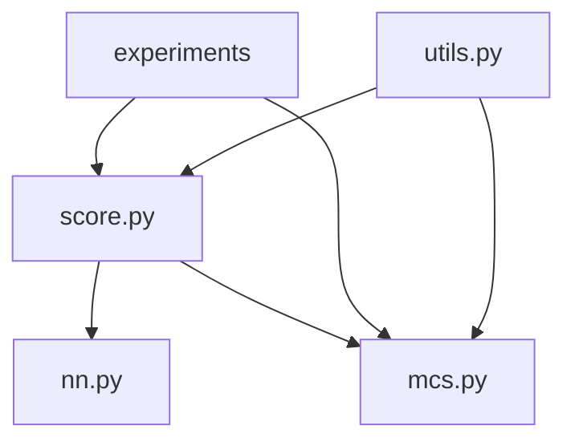

# SDA (Score-based Diffusion for Assimilation) 技術ドキュメント

## 目次
1. [概要](#概要)
2. [アーキテクチャ](#アーキテクチャ)
3. [コアモジュール詳細](#コアモジュール詳細)
4. [数学的基盤](#数学的基盤)
5. [実装詳細](#実装詳細)
6. [使用方法](#使用方法)
7. [API リファレンス](#api-リファレンス)

## 概要

SDA (Score-based Diffusion for Assimilation) は、大規模動的システム（大気、海洋など）の状態推定のためのスコアベース拡散モデルライブラリです。ノイズの多い観測データから、システムの状態軌跡を推論することができます。

### 主要な特徴
- **スコアベース生成モデル**: 複雑な確率分布を学習
- **データ同化**: ベイズ推論による観測データの統合
- **動的システム対応**: 時系列データの効率的な処理
- **ゼロショット推論**: 新しい観測シナリオへの適応が再学習不要

## アーキテクチャ

### ディレクトリ構造
```
sda/
├── sda/                    # コアライブラリ
│   ├── score.py           # スコアベースモデル
│   ├── nn.py              # ニューラルネットワーク
│   ├── mcs.py             # マルコフ連鎖システム
│   └── utils.py           # ユーティリティ関数
├── experiments/           # 実験コード
│   ├── kolmogorov/       # Kolmogorov流実験
│   └── lorenz/           # Lorenz系実験
└── docs/                 # ドキュメント
```

### モジュール間の依存関係


## コアモジュール詳細

### 1. score.py - スコアベースモデル

#### VPSDE (Variance Preserving SDE)
```python
class VPSDE(nn.Module):
    """
    前方拡散過程: dX = -1/2 β(t)X dt + √β(t) dW

    パラメータ:
        - eps: スコア関数 s_θ(x, t)
        - shape: データの形状
        - alpha_schedule: ノイズスケジュール ('linear', 'cosine', 'exp')
        - eta: 最小ノイズレベル
    """
```

前方過程の定義：
- μ(t) = α(t) （信号の減衰）
- σ(t)² = 1 - α(t)² + η² （ノイズの増加）

ここで α(t) は以下のスケジュールから選択：
- **Linear**: α(t) = (1 - t)α₀ + t·α₁
- **Cosine**: α(t) = cos(π/2 · t)
- **Exponential**: α(t) = exp(-t²/2σ²)

#### サンプリング手法

**Predictor-Corrector サンプリング**
```python
def sample(self, steps=100, corrections=1, tau=0.5):
    """
    逆方向SDEを数値積分してサンプルを生成

    1. Predictor: 逆方向SDEの離散化
       x_{t-dt} = r·x_t + (σ_{t-dt} - r·σ_t)·ε_θ(x_t, t)
       where r = μ_{t-dt} / μ_t

    2. Corrector: Langevin dynamicsによる補正
       x = x + τ·ε_θ(x, t) + √(2τ)·z
    """
```

#### DPSGaussianScore - 逆問題ソルバー
```python
class DPSGaussianScore(nn.Module):
    """
    ガウス観測モデル p(y|x) = N(y | A(x), Σ) に対する条件付きスコア

    Diffusion Posterior Sampling (DPS)アルゴリズムの実装
    - 事前学習されたスコアと観測尤度の勾配を組み合わせる
    - ゼロショット推論が可能
    """
```

### 2. nn.py - ニューラルネットワークアーキテクチャ

#### UNet アーキテクチャ
```python
class UNet(nn.Module):
    """
    時間条件付きU-Netアーキテクチャ

    特徴:
    - ModResidualBlock: 時間埋め込みによる変調
    - マルチスケール処理: エンコーダ・デコーダ構造
    - スキップ接続: 高解像度情報の保持

    サポート次元: 1D, 2D, 3D
    """
```

アーキテクチャの詳細：
1. **エンコーダ**: 段階的にダウンサンプリング
2. **ボトルネック**: 最深層での特徴変換
3. **デコーダ**: スキップ接続を用いてアップサンプリング
4. **時間条件付け**: 各ブロックで時間情報を注入

#### MCScoreNet - マルコフ連鎖用スコアネットワーク
```python
class MCScoreNet(nn.Module):
    """
    長い軌跡のスコアを短いセグメントのスコアに分解

    key insight: p(x_{0:T}) のスコア = Σ p(x_{t:t+w}) のスコア

    パラメータ:
        - order: 時間窓のサイズ
        - dim: 状態空間の次元
    """
```

### 3. mcs.py - マルコフ連鎖システム（動的システム）

#### 基底クラス
```python
class MarkovChain(ABC):
    """
    時間不変マルコフ連鎖の抽象基底クラス

    必須メソッド:
        - step(x, rng): 1ステップの時間発展
        - trajectory(x0, length, rng): 軌跡の生成
    """
```

#### 実装されている動的システム

**1. Lorenz63 - カオス的アトラクタ**
```python
class Lorenz63(DiscreteODE):
    """
    Lorenz 1963 カオスシステム
    dx/dt = σ(y - x)
    dy/dt = x(ρ - z) - y
    dz/dt = xy - βz

    デフォルトパラメータ: σ=10, ρ=28, β=8/3
    """
```

**2. KolmogorovFlow - 2D流体力学**
```python
class KolmogorovFlow(MarkovChain):
    """
    Kolmogorov強制を持つ2D Navier-Stokes方程式

    ∂u/∂t + u·∇u = -∇p + ν∇²u + f
    ∇·u = 0

    JAX-CFDを使用した高性能実装
    """
```

主要機能：
- **vorticity**: 渦度の計算
- **coarsen/upsample**: 解像度変換
- **periodic BC**: 周期境界条件

### 4. utils.py - ユーティリティ関数

#### TrajectoryDataset
```python
class TrajectoryDataset(Dataset):
    """
    HDF5形式の軌跡データセット

    データ構造:
        - /train: 訓練データ (80%)
        - /valid: 検証データ (10%)
        - /test: テストデータ (10%)

    各エントリ: shape=(trajectory_length, state_dim)
    """
```

#### 訓練ループ
```python
def loop(score, loader, optimizer, scheduler=None):
    """
    スコアマッチング訓練ループ

    損失関数: E[||ε - ε_θ(x_t, t)||²]
    where x_t = α(t)x_0 + σ(t)ε
    """
```

## 数学的基盤

### 1. スコアマッチング

確率密度 p(x) のスコア関数：
```
s(x) = ∇_x log p(x)
```

デノイジングスコアマッチング目的関数：
```
L(θ) = E_{t,x_0,ε}[λ(t)||ε - ε_θ(x_t, t)||²]
```

ここで：
- t ~ U(0, 1): 時間
- x_0 ~ p_data: データ分布
- ε ~ N(0, I): ガウスノイズ
- x_t = α(t)x_0 + σ(t)ε: ノイズ付きデータ

### 2. 逆方向SDE

前方SDE：
```
dx = f(x, t)dt + g(t)dw_t
```

対応する逆方向SDE：
```
dx = [f(x, t) - g(t)²∇_x log p_t(x)]dt + g(t)dw̄_t
```

### 3. データ同化

ベイズの定理による事後分布：
```
p(x|y) ∝ p(y|x)p(x)
```

スコアの分解：
```
∇_x log p(x|y) = ∇_x log p(x) + ∇_x log p(y|x)
```

DPSアルゴリズム：
1. 事前分布のスコア: ε_θ(x_t, t) で近似
2. 尤度の勾配: ∇_x log p(y|x_t) を解析的に計算
3. 組み合わせて条件付きサンプリング

### 4. マルコフ連鎖のスコア分解

長い軌跡 x_{0:T} のスコア：
```
∇ log p(x_{0:T}) = Σ_{t=0}^{T-w} ∇ log p(x_{t:t+w})
```

これにより：
- メモリ効率的な学習
- 任意長の軌跡への一般化
- 局所的な時間相関の捕捉

## 実装詳細

### 訓練プロセス

```python
# 1. データ生成
chain = KolmogorovFlow(resolution=32, dt=0.1)
dataset = chain.dataset(samples=1000, length=100)

# 2. スコアネットワークの初期化
score = MCScoreNet(
    chain=chain,
    order=4,  # 時間窓サイズ
    hidden=256,
    depth=6
)

# 3. SDEの定義
sde = VPSDE(score, shape=chain.shape)

# 4. 訓練
optimizer = Adam(sde.parameters(), lr=1e-3)
for epoch in range(100):
    loss = loop(sde, train_loader, optimizer)
```

### サンプリング

**無条件サンプリング**
```python
# ランダムノイズから開始
x_T = torch.randn(batch_size, *shape)

# 逆方向SDEを積分
samples = sde.sample(
    x=x_T,
    steps=1000,
    corrections=1,
    tau=0.5
)
```

**条件付きサンプリング（データ同化）**
```python
# 観測モデルの定義
A = lambda x: x[::2]  # 2点おきに観測
y = A(x_true) + noise

# DPSによる条件付きスコア
cond_score = DPSGaussianScore(
    y=y,
    A=A,
    zeta=noise_level,
    sde=sde
)

# 条件付きサンプリング
cond_sde = VPSDE(cond_score, shape=shape)
x_posterior = cond_sde.sample(steps=1000)
```

### GPU最適化

```python
# CUDAへの転送
sde = sde.cuda()

# 混合精度訓練
with torch.cuda.amp.autocast():
    loss = loop(sde, loader, optimizer)

# データ並列化
sde = nn.DataParallel(sde)
```

## 使用方法

### 1. 環境セットアップ

```bash
# Conda環境の作成
conda env create -f environment.yml
conda activate sda

# パッケージのインストール
pip install -e .
```

### 2. Kolmogorov流の実験

```bash
# データ生成
python experiments/kolmogorov/generate.py \
    --resolution 64 \
    --samples 10000 \
    --length 100

# 訓練
python experiments/kolmogorov/train.py \
    --data data/kolmogorov.h5 \
    --epochs 200 \
    --batch-size 32

# 評価・可視化
python experiments/kolmogorov/eval.py \
    --checkpoint checkpoints/best.pt \
    --output results/
```

### 3. カスタム動的システムの追加

```python
from sda.mcs import DiscreteODE

class CustomSystem(DiscreteODE):
    def __init__(self, dt=0.01):
        super().__init__(dt)

    def drift(self, x):
        # ODEの右辺を定義
        return -x + np.sin(x)

    def diffusion(self, x, rng):
        # 確率的項を定義（オプション）
        return 0.1 * rng.standard_normal(x.shape)
```

## API リファレンス

### VPSDE

```python
class VPSDE(nn.Module):
    def __init__(
        self,
        eps: nn.Module,           # スコアネットワーク
        shape: tuple = (),        # データ形状
        alpha: str = 'linear',    # ノイズスケジュール
        eta: float = 0.0,         # 最小ノイズ
        T: float = 1.0            # 終端時刻
    )

    def forward(
        self,
        x: Tensor,                # 入力データ
        t: Tensor = None,         # 時刻（Noneなら一様サンプリング）
        train: bool = False       # 訓練モード
    ) -> Tensor:
        """前方拡散過程のサンプリング"""

    def sample(
        self,
        shape: tuple = None,      # サンプル形状
        c: Tensor = None,         # 条件
        steps: int = 100,         # 積分ステップ数
        corrections: int = 0,     # 補正ステップ数
        tau: float = 0.5         # 補正強度
    ) -> Tensor:
        """逆方向SDEによるサンプリング"""

    def elbo(
        self,
        x: Tensor,                # データ
        c: Tensor = None          # 条件
    ) -> Tensor:
        """Evidence Lower Bound (ELBO) の計算"""
```

### MCScoreNet

```python
class MCScoreNet(nn.Module):
    def __init__(
        self,
        chain: MarkovChain,       # 動的システム
        score: nn.Module = None,  # ベーススコアネット
        order: int = 1,           # 時間窓サイズ
        hidden: int = 256,        # 隠れ層サイズ
        depth: int = 6,           # ネットワーク深さ
        activation: str = 'SiLU'  # 活性化関数
    )

    def forward(
        self,
        x: Tensor,                # 軌跡データ [B, T, D]
        t: Tensor,                # 時刻 [B]
        c: Tensor = None          # 条件
    ) -> Tensor:
        """軌跡のスコアを計算"""
```

### DPSGaussianScore

```python
class DPSGaussianScore(nn.Module):
    def __init__(
        self,
        y: Tensor,                # 観測データ
        A: Callable,              # 観測演算子
        zeta: float,              # ノイズレベル
        sde: VPSDE,               # 事前分布SDE
        detach: bool = False      # 勾配の切り離し
    )

    def forward(
        self,
        x: Tensor,                # 状態
        t: Tensor                 # 時刻
    ) -> Tensor:
        """条件付きスコアを計算"""
```

### KolmogorovFlow

```python
class KolmogorovFlow(MarkovChain):
    def __init__(
        self,
        resolution: int = 64,     # 空間解像度
        dt: float = 0.1,          # 時間ステップ
        domain_size: float = 1.0, # 領域サイズ
        viscosity: float = 1e-3,  # 動粘性係数
        drag: float = 0.1,        # 抵抗係数
        forcing_scale: float = 1.0 # 強制項スケール
    )

    def step(
        self,
        x: Array,                 # 現在の状態
        rng: PRNGKey = None       # 乱数キー（未使用）
    ) -> Array:
        """1時間ステップの発展"""

    def vorticity(
        self,
        x: Array                  # 速度場
    ) -> Array:
        """渦度の計算"""

    def coarsen(
        self,
        x: Array,                 # 高解像度場
        resolution: int           # 目標解像度
    ) -> Array:
        """ダウンサンプリング"""
```

## トラブルシューティング

### よくあるエラーと解決方法

**1. DPSGaussianScore.forward() の引数エラー**
```python
# 問題: c引数を渡しているが、DPSGaussianScoreはcを受け取らない
# 解決: c=Noneで呼び出すか、条件なしサンプリングを使用
x = sde.sample(steps=256, corrections=1, tau=0.5)  # c引数を省略
```

**2. メモリ不足エラー**
```python
# 問題: 大規模な軌跡でGPUメモリ不足
# 解決1: バッチサイズを減らす
train_loader = DataLoader(dataset, batch_size=8)  # 32から8に削減

# 解決2: gradient checkpointingを使用
from torch.utils.checkpoint import checkpoint
```

**3. JAX-CFD インストールエラー**
```bash
# JAXとJAX-CFDの互換性問題
# 解決: 特定バージョンをインストール
pip install jax==0.4.13 jax-cfd==0.2.0
```

## パフォーマンス最適化

### 1. 訓練の高速化
- **混合精度訓練**: メモリ使用量を削減し、訓練を高速化
- **データローダーの最適化**: num_workers, pin_memoryの調整
- **勾配累積**: 実効バッチサイズを増やす

### 2. サンプリングの高速化
- **ステップ数の削減**: DDIMなどの高速サンプラーを使用
- **並列サンプリング**: バッチ処理で複数サンプルを同時生成
- **低精度推論**: FP16やINT8量子化

### 3. メモリ効率化
- **Gradient Checkpointing**: 活性化の再計算でメモリ削減
- **モデル並列化**: 大規模モデルを複数GPUに分散
- **動的バッチング**: 可変長軌跡の効率的な処理

## 参考文献

1. **Score-based Generative Modeling**
   - Song et al. (2021) "Score-Based Generative Modeling through Stochastic Differential Equations"
   - Vincent (2011) "A Connection Between Score Matching and Denoising Autoencoders"

2. **Diffusion Posterior Sampling**
   - Chung et al. (2022) "Diffusion Posterior Sampling for General Noisy Inverse Problems"
   - Song et al. (2023) "Pseudoinverse-Guided Diffusion Models for Inverse Problems"

3. **Data Assimilation**
   - Rozet & Louppe (2023) "Score-based Data Assimilation"
   - Evensen (2009) "Data Assimilation: The Ensemble Kalman Filter"

4. **動的システム**
   - Lorenz (1963) "Deterministic Nonperiodic Flow"
   - Kolmogorov (1941) "The Local Structure of Turbulence"

## ライセンス

MIT License - 詳細は LICENSE ファイルを参照

## 貢献

プルリクエストを歓迎します。大きな変更の場合は、まずissueを開いて議論してください。

## サポート

- GitHub Issues: バグ報告と機能要望
- Discussions: 一般的な質問と議論
- Email: support@example.com